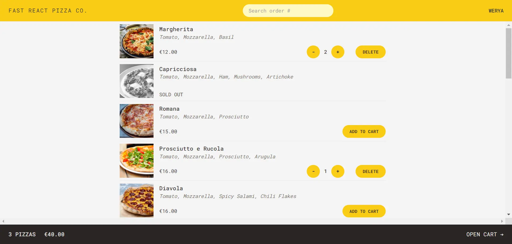

## :pizza: Fast-React-Pizza

  

### :page_facing_up: About

**Fast-React-Pizza** is a web application for a pizza restaurant that allows customers to order pizza online and track the progress of their orders.

### :star2: Features

- Uses **ReactJS** as the frontend framework and **Tailwind CSS** for styling
- Uses **React Router** for routing and navigation
- A **fully responsive** design that adapts to different screen sizes and devices
- Fetches the menu items from an **API** and displays them in a user-friendly interface
- Sends the orders to the **API** and updates the customers on the status of their orders

### :computer: Installation

To run this project locally, you need to have Node.js and npm installed on your machine. Then, follow these steps:

Clone this repository to your local machine
Navigate to the project folder and run `npm install` to install the dependencies
Run `npm run dev` to start the development server
Open http://localhost:5173 in your browser to view the application

### :clapper: Live Demo
You can view a live demo of this project **[Here](https://fast-react-pizza-wrry.netlify.app)** 
➡️ To load faster please connect your VPN and then see the live demo.

### :copyright: Postscript

This project is written based on a [React course](https://www.udemy.com/course/the-ultimate-react-course/) created by [Jonas Schmedtmann](https://github.com/jonasschmedtmann) and its copyright belongs to him.
